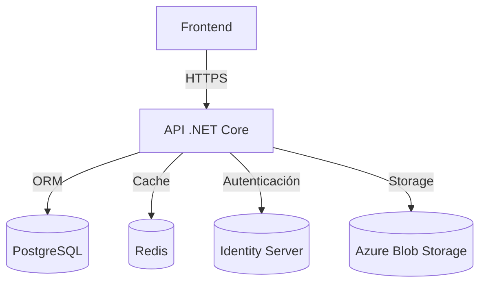

# LoveRose - Documentación de Arquitectura Técnica

## 1. Visión General

Arquitectura en capas siguiendo los principios de Clean Architecture y Domain-Driven Design (DDD), implementada con .NET 8 para el backend y React 18 con TypeScript para el frontend.

### Diagrama de Arquitectura



## 2. Estructura del Proyecto

### Backend (.NET 8)

```
src/
├── LoveRose.API/           # Capa de Presentación
│   ├── Controllers/       # Controladores de la API
│   ├── Middleware/        # Middleware personalizado
│   ├── Filters/          # Filtros de acción
│   └── Program.cs        # Punto de entrada
│
├── LoveRose.Core/         # Capa de Dominio
│   ├── Entities/         # Entidades del dominio
│   ├── Interfaces/       # Interfaces de repositorios y servicios
│   ├── Services/         # Lógica de negocio
│   └── Exceptions/       # Excepciones personalizadas
│
└── LoveRose.Infrastructure/ # Capa de Infraestructura
    ├── Data/             # Configuración de EF Core
    ├── Identity/         # Configuración de Identity
    └── Services/         # Implementaciones de servicios externos

tests/
├── LoveRose.UnitTests/    # Pruebas unitarias
└── LoveRose.IntegrationTests/ # Pruebas de integración
```

### Frontend (React + TypeScript + Vite)

```
frontend/
├── public/                 # Assets estáticos
└── src/
    ├── api/               # Clientes y configuraciones de API
    ├── application/        # Lógica de aplicación
    │   ├── dtos/          # Objetos de transferencia de datos
    │   ├── services/      # Implementación de servicios
    │   └── useCases/      # Casos de uso de la aplicación
    ├── components/         # Componentes de UI reutilizables
    ├── config/             # Configuraciones
    ├── contexts/           # Contextos de React (Auth, Theme, etc.)
    ├── domain/             # Lógica de dominio
    ├── hooks/              # Custom hooks
    ├── pages/              # Componentes de página
    ├── presentation/       # Componentes de presentación
    └── utils/              # Utilidades y helpers
```

## 3. Patrones de Diseño y Arquitectura

### Principios SOLID
- **S**ingle Responsibility: Cada clase tiene una única responsabilidad
- **O**pen/Closed: Abierto para extensión, cerrado para modificación
- **L**iskov Substitution: Las clases derivadas deben ser sustituibles por sus clases base
- **I**nterface Segregation: Muchas interfaces específicas son mejores que una general
- **D**ependency Inversion: Depender de abstracciones, no de implementaciones

### Patrones Utilizados
- **Repository**: Para el acceso a datos
- **Unit of Work**: Para manejar transacciones
- **CQRS**: Separación de consultas y comandos
- **Mediator**: Para desacoplar componentes
- **Factory**: Para la creación de objetos complejos
- **Strategy**: Para implementar algoritmos intercambiables

## 4. Flujo de Datos

### Autenticación y Autorización
1. Cliente envía credenciales a `/api/auth/login`
2. Servidor valida y devuelve JWT + Refresh Token
3. Cliente incluye JWT en el header `Authorization`
4. Middleware JWT valida el token en cada petición
5. Autorización basada en roles con `[Authorize(Roles = "Admin,Moderator")]`

### Procesamiento de Peticiones
1. **Middleware**: Manejo de excepciones, autenticación, CORS
2. **Controladores**: Validación de entrada, orquestación
3. **Servicios**: Lógica de negocio
4. **Repositorios**: Acceso a datos
5. **Base de Datos**: Almacenamiento persistente

## 5. Base de Datos

### Modelo Relacional

```mermaid
erDiagram
    USER ||--o{ POST : creates
    USER ||--o{ COMMENT : writes
    USER ||--o{ TRANSACTION : has
    
    USER {
        string Id PK
        string UserName
        string Email
        string PasswordHash
        string FirstName
        string LastName
        string AvatarUrl
        DateTime CreatedAt
        DateTime? LastLogin
        bool IsActive
    }
    
    POST {
        string Id PK
        string UserId FK
        string Title
        string Content
        string Status
        DateTime CreatedAt
        DateTime? UpdatedAt
    }
    
    COMMENT {
        string Id PK
        string PostId FK
        string UserId FK
        string Content
        DateTime CreatedAt
    }
    
    TRANSACTION {
        string Id PK
        string FromUserId FK
        string ToUserId FK
        decimal Amount
        string Currency
        string Status
        DateTime CreatedAt
    }
```

## 6. Seguridad

### Autenticación
- JWT con expiración corta (15-30 minutos)
- Refresh tokens con expiración larga (7 días)
- Protección contra ataques CSRF
- Rate limiting para endpoints de autenticación

### Autorización
- Roles: Admin, Moderator, User, ContentCreator
- Políticas personalizadas para recursos específicos
- Claims personalizados para permisos granulares

### Protección de Datos
- Encriptación de datos sensibles
- Mascaramiento de información confidencial en logs
- Headers de seguridad HTTP (CSP, HSTS, etc.)

## 7. Rendimiento

### Caché
- Redis para caché distribuido
- Cache de consultas frecuentes
- Invalidación de caché automática

### Optimizaciones
- Paginación en todos los endpoints de listados
- Proyecciones para consultas eficientes
- Carga diferida (lazy loading) donde sea apropiado
- Compresión de respuestas HTTP

## 8. Monitoreo y Logging

### Logging
- Serilog para logging estructurado
- Niveles: Debug, Information, Warning, Error, Critical
- Enriquecimiento de logs con contexto de la petición

### Monitoreo
- Health checks para dependencias
- Métricas de rendimiento
- Alertas para errores críticos
- Integración con Application Insights

## 9. Pruebas

### Backend
- **Unit Tests**: xUnit para pruebas unitarias
- **Integration Tests**: Pruebas de integración con TestServer
- **Test Coverage**: Cobertura mínima del 80%

### Frontend
- **Unit Tests**: Jest + React Testing Library
- **Component Tests**: Pruebas de componentes aislados
- **E2E**: Cypress para pruebas de extremo a extremo

## 10. Despliegue

### Entornos
- **Development**: Local y desarrollo
- **Staging**: Pre-producción para pruebas
- **Production**: Producción

### Infraestructura como Código
- Terraform para infraestructura en la nube
- Docker para contenedorización
- Kubernetes para orquestación

## 11. Documentación

### API
- Swagger/OpenAPI 3.0
- Ejemplos de peticiones/respuestas
- Códigos de estado HTTP

### Código
- Comentarios XML en métodos públicos
- Guías de contribución
- Decisiones de arquitectura (ADR)
