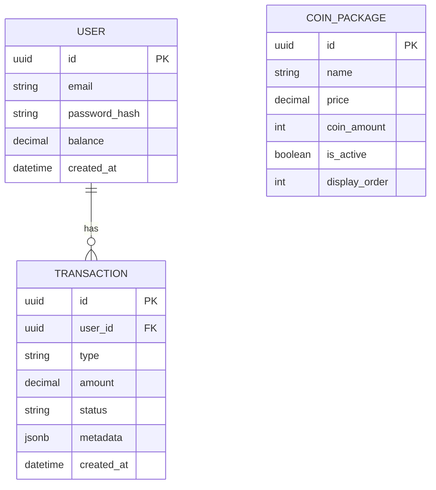

# LoveRose - Documentación de Arquitectura

## 1. Visión General
Arquitectura en capas siguiendo principios de Clean Architecture:

```
frontend/
├── public/             # Assets estáticos
└── src/
    ├── api/            # Clientes y configuraciones de API
    ├── assets/         # Recursos estáticos
    ├── components/     # Componentes de UI reutilizables
    ├── contexts/       # Contextos de React
    ├── hooks/          # Custom hooks
    ├── pages/          # Componentes de página
    ├── services/       # Lógica de negocio y servicios
    ├── theme/          # Configuración de temas
    └── utils/          # Utilidades y helpers

backend/
├── src/
    ├── config/         # Configuraciones
    ├── controllers/    # Controladores
    ├── models/         # Modelos de base de datos
    ├── routes/         # Definición de rutas
    ├── services/       # Lógica de negocio
    └── utils/          # Utilidades
```

## 2. Flujo de Datos

### Frontend
1. **Capa de Presentación**: Componentes React
2. **Gestión de Estado**: Context API + Hooks
3. **Lógica de Negocio**: Servicios
4. **Comunicación**: Axios con interceptores

### Backend
1. **Rutas** → **Controladores** → **Servicios** → **Modelos**
2. Validación de datos en cada capa
3. Manejo centralizado de errores

## 3. Estructura de la Base de Datos



## 4. Seguridad
- Autenticación JWT
- Validación de entrada en frontend y backend
- Protección contra CSRF
- Rate limiting
- CORS configurado
