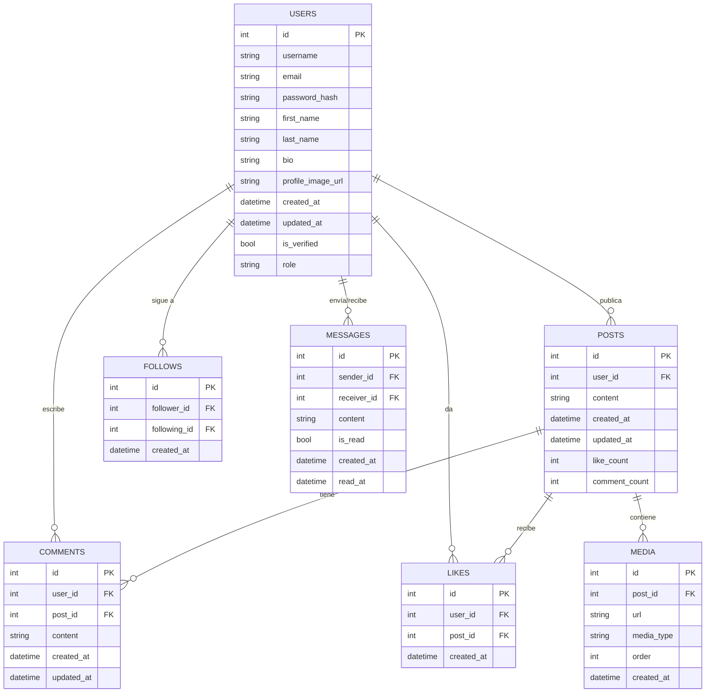

# LoveRose Database Setup and Migrations

This document provides instructions for setting up the LoveRose database and applying migrations.

## Prerequisites

- .NET 8.0 SDK or later
- PostgreSQL 14 or later
- Entity Framework Core Tools

## Installation

1. Install the EF Core tools globally (if not already installed):
   ```bash
   dotnet tool install --global dotnet-ef
   ```

2. Update the connection string in `appsettings.json`:
   ```json
   {
     "ConnectionStrings": {
       "DefaultConnection": "Host=localhost;Database=love_rose;Username=your_username;Password=your_password"
     }
   }
   ```

## Running Migrations

### Using PowerShell Script (Recommended)

1. Open a PowerShell terminal
2. Navigate to the project root directory
3. Run the migration script:
   ```powershell
   .\scripts\apply-migrations.ps1 -Environment Development -UpdateDatabase -SeedData
   ```

### Manual Commands

1. Create a migration:
   ```bash
   cd src/LoveRose.Infrastructure
   dotnet ef migrations add InitialCreate --startup-project ../LoveRose.API -o Data/Migrations
   ```

2. Apply migrations:
   ```bash
   dotnet ef database update --startup-project ../LoveRose.API
   ```

## Database Schema

### Main Tables

- `users` - User accounts and profiles
- `roles` - Application roles
- `posts` - User posts
- `comments` - Post comments
- `stories` - Temporary posts (24h)
- `messages` - Private messages between users
- `notifications` - System notifications
- `transactions` - Financial transactions
- `video_calls` - Video call history
- `bookmarks` - Saved posts

## Seeding Data

The database can be seeded with initial data using the `-SeedData` flag:

```powershell
.\scripts\apply-migrations.ps1 -Environment Development -SeedData
```

## Environment Variables

| Variable | Description | Default |
|----------|-------------|---------|
| ASPNETCORE_ENVIRONMENT | Application environment | Development |
| ConnectionStrings__DefaultConnection | Database connection string | - |
| JWT__Key | JWT signing key | - |
| JWT__Issuer | JWT issuer | - |
| JWT__Audience | JWT audience | - |

## Troubleshooting

### Common Issues

1. **Migrations not applying**
   - Ensure the database server is running
   - Verify connection string in `appsettings.json`
   - Check if the database user has sufficient permissions

2. **Missing EF Core tools**
   ```bash
   dotnet tool install --global dotnet-ef
   ```

3. **Database connection errors**
   - Verify PostgreSQL service is running
   - Check if the database exists
   - Validate connection string parameters

## Backup and Restore

### Create Backup
```bash
pg_dump -U your_username -d love_rose -f backup_$(date +%Y%m%d).sql
```

### Restore from Backup
```bash
psql -U your_username -d love_rose -f backup_20230908.sql
```

## License

This project is licensed under the MIT License - see the [LICENSE](LICENSE) file for details.

## Base de Datos LoveRose

### Visión General

La base de datos de LoveRose está diseñada para ser escalable, segura y de alto rendimiento. Utilizamos PostgreSQL como sistema de gestión de bases de datos relacional (RDBMS) por su robustez, rendimiento y características avanzadas.

### Esquema de la Base de Datos

#### Diagrama Entidad-Relación



### Tablas Principales

#### 1. Users

Almacena la información de los usuarios de la plataforma.

| Columna | Tipo | Descripción |
|---------|------|-------------|
| id | SERIAL | Identificador único |
| username | VARCHAR(50) | Nombre de usuario único |
| email | VARCHAR(255) | Correo electrónico único |
| password_hash | VARCHAR(255) | Hash de la contraseña |
| first_name | VARCHAR(100) | Nombre del usuario |
| last_name | VARCHAR(100) | Apellido del usuario |
| bio | TEXT | Biografía del perfil |
| profile_image_url | VARCHAR(500) | URL de la imagen de perfil |
| created_at | TIMESTAMP | Fecha de creación |
| updated_at | TIMESTAMP | Última actualización |
| is_verified | BOOLEAN | Si el correo está verificado |
| role | VARCHAR(20) | Rol del usuario (Admin, User, etc.) |

#### 2. Posts

Almacena las publicaciones de los usuarios.

| Columna | Tipo | Descripción |
|---------|------|-------------|
| id | SERIAL | Identificador único |
| user_id | INTEGER | ID del usuario que creó el post |
| content | TEXT | Contenido del post |
| created_at | TIMESTAMP | Fecha de creación |
| updated_at | TIMESTAMP | Última actualización |
| like_count | INTEGER | Contador de likes |
| comment_count | INTEGER | Contador de comentarios |

#### 3. Comments

Comentarios en las publicaciones.

| Columna | Tipo | Descripción |
|---------|------|-------------|
| id | SERIAL | Identificador único |
| user_id | INTEGER | ID del usuario que comentó |
| post_id | INTEGER | ID del post comentado |
| content | TEXT | Contenido del comentario |
| created_at | TIMESTAMP | Fecha de creación |
| updated_at | TIMESTAMP | Última actualización |

#### 4. Likes

Registro de likes en publicaciones.

| Columna | Tipo | Descripción |
|---------|------|-------------|
| id | SERIAL | Identificador único |
| user_id | INTEGER | ID del usuario que dio like |
| post_id | INTEGER | ID del post que recibió like |
| created_at | TIMESTAMP | Fecha del like |

#### 5. Follows

Relaciones de seguimiento entre usuarios.

| Columna | Tipo | Descripción |
|---------|------|-------------|
| id | SERIAL | Identificador único |
| follower_id | INTEGER | ID del seguidor |
| following_id | INTEGER | ID del seguido |
| created_at | TIMESTAMP | Fecha del seguimiento |

#### 6. Messages

Mensajes directos entre usuarios.

| Columna | Tipo | Descripción |
|---------|------|-------------|
| id | SERIAL | Identificador único |
| sender_id | INTEGER | ID del remitente |
| receiver_id | INTEGER | ID del destinatario |
| content | TEXT | Contenido del mensaje |
| is_read | BOOLEAN | Si el mensaje fue leído |
| created_at | TIMESTAMP | Fecha de envío |
| read_at | TIMESTAMP | Fecha de lectura |

#### 7. Media

Archivos multimedia asociados a publicaciones.

| Columna | Tipo | Descripción |
|---------|------|-------------|
| id | SERIAL | Identificador único |
| post_id | INTEGER | ID del post relacionado |
| url | VARCHAR(500) | URL del archivo multimedia |
| media_type | VARCHAR(50) | Tipo de medio (image/jpeg, video/mp4, etc.) |
| order | INTEGER | Orden de visualización |
| created_at | TIMESTAMP | Fecha de creación |

### Índices

Para optimizar el rendimiento, se han creado los siguientes índices:

```sql
-- Índices para Users
CREATE UNIQUE INDEX idx_users_username ON users(LOWER(username));
CREATE UNIQUE INDEX idx_users_email ON users(LOWER(email));

-- Índices para Posts
CREATE INDEX idx_posts_user_id ON posts(user_id);
CREATE INDEX idx_posts_created_at ON posts(created_at DESC);

-- Índices para Comments
CREATE INDEX idx_comments_post_id ON comments(post_id);
CREATE INDEX idx_comments_user_id ON comments(user_id);

-- Índices para Likes
CREATE UNIQUE INDEX idx_likes_user_post ON likes(user_id, post_id);
CREATE INDEX idx_likes_post_id ON likes(post_id);

-- Índices para Follows
CREATE UNIQUE INDEX idx_follows_relationship ON follows(follower_id, following_id);
CREATE INDEX idx_follows_following_id ON follows(following_id);

-- Índices para Messages
CREATE INDEX idx_messages_sender_receiver ON messages(sender_id, receiver_id);
CREATE INDEX idx_messages_created_at ON messages(created_at DESC);
```

### Migraciones

El proyecto utiliza Entity Framework Core para gestionar las migraciones de la base de datos. Los comandos más comunes son:

```bash
# Crear una nueva migración
dotnet ef migrations add NombreDeLaMigracion --project src/LoveRose.Infrastructure --startup-project src/LoveRose.API

# Aplicar migraciones
dotnet ef database update --project src/LoveRose.Infrastructure --startup-project src/LoveRose.API

# Revertir la última migración
dotnet ef database update NombreDeLaMigracionAnterior --project src/LoveRose.Infrastructure --startup-project src/LoveRose.API
```

### Copias de Seguridad

Se recomienda configurar copias de seguridad automáticas siguiendo estos pasos:

1. **Backup Completo Diario**:
   ```bash
   pg_dump -U username -d love_rose -f /backups/love_rose_$(date +%Y%m%d).sql
   ```

2. **Backup Diferencial Cada Hora**:
   ```bash
   pg_dump -U username -d love_rose -F c -f /backups/hourly/love_rose_$(date +%Y%m%d_%H).backup
   ```

3. **Retención**:
   - Mantener copias diarias por 30 días
   - Mantener copias semanales por 3 meses
   - Mantener copias mensuales por 1 año

### Seguridad

#### Cifrado
- Las contraseñas se almacenan con hash utilizando bcrypt
- Los datos sensibles como tokens se cifran en reposo

#### Permisos
- Usuarios solo pueden modificar sus propios datos
- Validación de entrada en todos los endpoints
- Protección contra inyección SQL con parámetros

#### Auditoría
- Todas las tablas incluyen `created_at` y `updated_at`
- Registro de operaciones críticas
- Monitoreo de accesos sospechosos

### Rendimiento

#### Particionamiento
- La tabla `posts` está particionada por rangos de fechas
- Las tablas de logs se particionan mensualmente

#### Réplicas
- Configuración maestro-esclavo para lectura/escritura
- Réplicas de solo lectura para consultas pesadas

#### Caché
- Redis para caché de consultas frecuentes
- Invalidation automática al actualizar datos

### Monitoreo

#### Métricas Clave
- Tasa de aciertos de caché
- Tiempo promedio de consulta
- Uso de conexiones
- Espacio en disco

#### Alertas
- Alto uso de CPU/Memoria
- Largos tiempos de respuesta
- Errores en consultas
- Espacio en disco bajo
